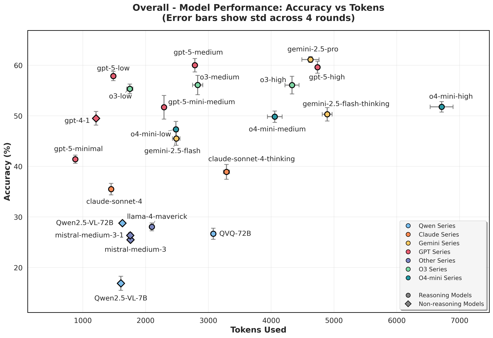

# 📊 LRM-Eval


🏠[Home](https://github.com/flageval-baai/LRM-Eval) | 🤗[Data](https://huggingface.co/datasets/BAAI/ROME) | 🤗[Evaluation Response](https://huggingface.co/datasets/BAAI/ROME-V-evaluated) | 💻[Github Code](https://github.com/flageval-baai/ROME-evaluation) | 📄[Paper](https://arxiv.org/) | *Current Version: v1.0*

This repository contains the evaluation code of Rome from the paper [A Preliminary Contamination-Free Evaluation of Reasoning Models](https://arxiv.org/).

## 📰 News
**[02/09/2024]** 🚀 First release of [Rome](https://huggingface.co/datasets/BAAI/ROME).
We released our [leaderboard](https://github.com/flageval-baai/LRM-Eval) on **30+ LLMs and MLLMs** that we have tested so far.
We also released all model responses across 4 rounds of evaluations ([Model response](https://huggingface.co/datasets/BAAI/ROME-evaluated)).

## 📊 Data and model performance

### Text tasks
Textual problems include the following subtasks:

* Problem solving
    * college course questions, word puzzles, and deciphering
* Algorithmic Coding
    * recent released code problems
* Task Completion
    * instruction following, multi-turn instruction following, long-Context Understanding
* Factuality and Abstention
    * long-tailed knowledge
* Safety
    * harmful generation and jailbreaking


Scatter plots on overall accuracy and token consumption for textual problems


Visual tasks include 8 subtasks (281 high-quality questions in total). Each sample has been carefully checked to ensure that images are necessary to answer the questions correctly:
* Academic
    * questions from college courses
* Diagrams
    * charts and figures collected from recent scientific papers, reports, or blog posts
* Puzzles and game
    * raven tests, Rebus puzzles and game play
* Memes
    * recreated memes
* Geo
    * geolocation Inference
* Recognition
    * fine-grained recognition
* Multi-image
    * find-the-difference or video frame reordering.
* Spatial
    * elative positions, depths/distances, height, etc

Scatter plots on overall accuracy and token consumption for visual problems


## 👋 Evaluation Findings
We conduct a moderate-scale, contamination-free evaluation of current LRMs with some preliminary findings. 

* With a few more thousands of thinking tokens, LRMs consistently show superior performance than their non-thinking counterparts in solving challenging problems or puzzles.
* LRMs achieving high metrics on previous benchmarks are also showing within-task generalization, thus benchmark saturation should not always be attributed to contamination or memorization.
* Many recently findings from LRMs might be model-specific or data-specific. For instance, we observe slight degradation in instruction following only on Claude Sonnet 4 and DeepSeek series, and on Qwen 3 and DeepSeek LRMs in multi-turn settings.
* There exists degradation in multi-turn settings for some LRMs against their non-thinking counterparts, even when they are showing superior or on-par metrics on single-turn instructions following.
* Current open-weight LRMs may tend to show more vulnerability against harmful content prompts or jailbreaking, implying necessity of careful deployment.
* Current-generation text-based inference-time scaling has not yet brought notable gains on visual reasoning for most VLMs. %\emoji{-1} 
* Performance varies too much for generally difficult subsets which implies huge difficulty in conducting statistically reliable evaluation at moderate cost.
* Many top-tier LRMs may pretend to conduct tool use or web search even when they do not have real access, which leaves question on reliability. We appeal for more transparency in revealing the reasoning details to enable more awareness during usage, especially multimodal contents.
* Signals of misaligned thinking and answers: models are optimized to be stronger but also more difficult to monitor or to interpret, with inconsistency between thinking and answers being non-trivially prevalent for many LRMs we investigated.
* Different model developers seem to prioritize things differently: On visual questions (our ROME benchmark), Gemini 2.5 Pro tops in overall accuracy, o4-mini and GPT-5 strike a better balance in performance and token consumption, while Claude Sonnet 4 is showing the best controlled thinking behaviors.


## 📐 Evaluation Script Usage

We use 5 evaluators and human-curated annotations to evaluate the model's performance:
- key_items_matching: we check if the key items occur in the model's answer
- choices_matching: match the model's answer with the choices extracted from the question
- ordered_list_matching: match the model's answer with the ordered list
- number_matching: match the model's answer with the number (allowing a 10% relative error for floats and a 1e-3 absolute error for integers)
- location_matching: match the model's answer with the location (supporting both fine-grained and coarse-grained matching)

### How to Use the Evaluator Script

Convert your evaluation into the specific format as listed in [Inputs and formats](#inputs-and-formats). Then execute the following command:


```bash
python src/evaluate.py \
  --annotations /path/to/annotations.json \
  --predictions /path/to/predictions.json \
  [--use_llm_evaluator] \
  [--llm_model gpt-4.1-mini] \
  [--output /path/to/scores.json] \
  [--updated /path/to/updated_predictions.json]
```

- `--annotations` (required): JSON/JSONL with annotations (array or dict keyed by `question_id`).
- `--predictions` (required): JSON/JSONL predictions in one of the supported shapes.
- `--use_llm_evaluator`: Enables LLM-based semantic grading (otherwise rule-based only).
- `--llm_model`: Specifies the model name for LLM grading. Default reads from `OPENAI_MODEL` or uses `gpt-4.1-mini`.
- `--output`: Specifies the output path for scores. Default: `scores.json` next to the predictions file.

Environment variables for LLM grading (required when `--use_llm_evaluator`):
- `OPENAI_API_KEY`
- `OPENAI_BASE_URL`
- `OPENAI_MODEL` (optional; can also pass via `--llm_model`)


### Inputs and Formats
- Annotations (JSON or JSONL):
  - Accepts either an array of objects or a dictionary keyed by `question_id`.
  - Each item must include at least:
    - `question_id`: a unique identifier for the question
    - `evaluator`: one of: `key_items_matching`, `choices_matching`, `ordered_list_matching`, `number_matching`, `location_matching`
    - `evaluator_kwargs`: evaluator-specific arguments (see below)
  - Recommended (for LLM grading): `question`, `reference`
  - Optional: any fields used for aggregation (e.g., `task`, `question_type`, etc.)

Example (see `src/example/annotation.json` and `src/example/predictions.json` for details):
```json
[
  {
    "question_id": "question_diagrams_2",
    "question": "Which team(s) will play all the group stage games with no traveling between venues?",
    "reference": "Monterrey and Seattle Sounders",
    "task": "open",
    "reasoning_type": "VL",
    "evaluator": "key_items_matching",
    "evaluator_kwargs": {
      "key_items": [["Monterrey"], ["Seattle Sounders"]]
    }
  }
]
```

- Predictions (JSON or JSONL):
  - Accepts any of the following forms:
    1) Single object with `question_id` and `answer`.
    2) Array of objects, each with `question_id` and `answer`.
    3) Dictionary keyed by `question_id` whose values contain `answer`.

Examples:
```json
{ "question_id": "question_diagrams_2", "answer": "Monterrey" }
```
```json
[
  { "question_id": "1", "answer": "A" },
  { "question_id": "2", "answer": "Final Answer: 42" }
]
```

### Supported evaluators and required kwargs

- key_items_matching: `{ "key_items": List[List[str]], "remove_space"?: bool }`
- choices_matching: `{ "label": str }` (case-insensitive, supports multi-label like "AC")
- ordered_list_matching: `{ "order": List[str] | str }` (checks subsequence order)
- number_matching: `{ "value_to_match": number }`
- location_matching: `{ "location_fine_grained": List[str], "location_coarse_grained"?: List[str], "fine_grained_score"?: number, "coarse_grained_score"?: number }`

Answers are auto-normalized and extracted internally (e.g., stripping "Final Answer:", handling LaTeX `\boxed{}`), so you only need to provide the raw model answer in `answer`.

### Outputs

- Scores: written to `--output` (default: `<predictions_dir>/scores.json`) and also printed to stdout.
- Updated predictions: `<predictions_dir>/updated_predictions.json`, containing merged ground-truth fields and normalized answers per item.

The scores JSON includes:
- `final_score`: `[sum_of_scores, total_count]`
- `accuracy`: overall accuracy in percentage
- Per-bucket entries keyed by `tracker_type` values: `[score_sum, count, accuracy, { subtype: [score_sum, count, accuracy], ... }]`

## Citation
If you use our work and are inspired by our work, please consider cite us (available soon):
```bibtex
@article{LRM-Eval,
  title={A Preliminary Contamination-Free Evaluation of Reasoning Models},
  author={BAAI FlagEval Team},
  journal={arXiv preprint arXiv:},
  year={2025}
}
```
