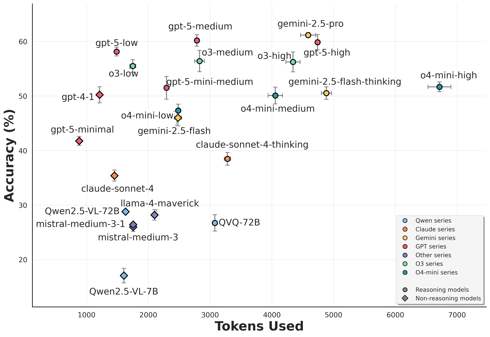

# ROME: Reasoning-Oriented Model Evaluation

[](https://arxiv.org/pdf/2509.17177)
[](https://arxiv.org/abs/2509.17177)
[](https://huggingface.co/datasets/BAAI/ROME)
[](https://huggingface.co/datasets/BAAI/ROME-evaluated)
[](https://github.com/flageval-baai/ROME-evaluation)
[](https://github.com/flageval-baai/LRM-Eval)

This repository contains the evaluation code for ROME described in the paper [A Preliminary Contamination-Free Evaluation of Reasoning Models](https://arxiv.org/pdf/2509.17177).

## 📰 News
**[02/09/2024]** 🚀 First release of [ROME](https://huggingface.co/datasets/BAAI/ROME).
We released our [leaderboard](https://github.com/flageval-baai/LRM-Eval) covering **30+ LLMs and MLLMs** tested so far.
We also released all model responses across four rounds of evaluation ([Model responses](https://huggingface.co/datasets/BAAI/ROME-evaluated)).

## 📊 Data and Model Performance

### Text Tasks
Text tasks include the following subtasks:

* Problem solving
    * college-level course questions, word puzzles, and deciphering
* Algorithmic coding
    * recently released coding problems
* Task completion
    * instruction following, multi-turn instruction following, long-context understanding
* Factuality and abstention
    * long-tailed knowledge
* Safety
    * harmful content generation and jailbreaking


Scatter plot of overall accuracy vs. token consumption for textual problems


Visual tasks include 8 subtasks (281 high-quality questions in total). Each sample has been verified to ensure that images are necessary to answer correctly:
* Academic
    * questions from college courses
* Diagrams
    * charts and figures collected from recent scientific papers, reports, or blog posts
* Puzzles and games
    * Raven's Progressive Matrices, rebus puzzles, and gameplay
* Memes
    * recreated memes
* Geo
    * geolocation inference
* Recognition
    * fine-grained recognition
* Multi-image
    * find-the-difference tasks or video frame reordering.
* Spatial
    * relative positions, depths/distances, heights, etc

Scatter plot of overall accuracy vs. token consumption for visual problems


## 👋 Evaluation Findings
We conduct a moderate-scale, contamination-free evaluation of current LRMs with some preliminary findings. 

* We observe concerning signals of **misaligned thinking and answers**, more or less appearing on all LRMs we have investigated: the actual answer given in the model response may differ from what has been concluded in the reasoning process. It has also been prevalent that the reasoning process implies clear uncertainty but the LRM finally gives a very deterministic answer. Even many of the top-tier LRMs do not seem to know when to abstain.
* Many top-tier LRMs may **pretend to have used an external tool or conducted a web search** during reasoning even when they do not have real access, leaving a big question mark on credibility and reliability. We appeal for more transparency in revealing more reasoning details to enable sufficient awareness during usage, especially for conversations involving multimodal reasoning.
* Current open-weight LRMs may tend to show more vulnerability against harmful content prompts or jailbreaking, implying necessity of more careful deployment.
* Some recent findings on LRMs (versus non-thinking counterparts) might be model-specific or data-specific. For instance, we observe degradation in (verifiable) instruction following only on Claude Sonnet 4 and DeepSeek series, but more LRMs show weaknesses in multi-turn settings.
* Text-based inference-time scaling has not yet brought as notable gains on visual reasoning.
* Performance varies too much for generally difficult subsets, which implies a big challenge in conducting statistically reliable evaluation at moderate cost.
* Different model developers might have been prioritizing things differently: GPT-5 series comprehensively show superiority in textual problem solving. On visual questions (our new benchmark named ROME), Gemini 2.5 Pro marginally tops in overall accuracy, o4-mini and GPT-5 strike a better balance with token consumption, while Claude Sonnet 4 is showing relatively the best controlled thinking behaviors overall.


## 📐 Evaluation Script Usage

We use five rule-based evaluators alongside human-curated annotations to evaluate model performance:
- key_items_matching: checks whether key items occur in the model's answer
- choices_matching: matches the model's answer to choices extracted from the question
- ordered_list_matching: matches the model's answer to an ordered list
- number_matching: matches numeric answers (±10% relative for floats; ±1e-3 absolute for integers)
- location_matching: matches locations (supports fine-grained and coarse-grained matching)

### How to Use the Evaluator Script

Convert your data into the formats listed under [Inputs and Formats](#inputs-and-formats), then run:


```bash
python src/evaluate.py \
  --annotations /path/to/annotations.json \
  --predictions /path/to/predictions.json \
  [--use_llm_evaluator] \
  [--llm_model gpt-4.1-mini] \
  [--output /path/to/scores.json] \
  [--updated /path/to/updated_predictions.json]
```

- `--annotations` (required): JSON/JSONL with annotations (array or dict keyed by `question_id`).
- `--predictions` (required): JSON/JSONL predictions in one of the supported shapes.
- `--use_llm_evaluator`: Enables LLM-based semantic grading (otherwise rule-based only).
- `--llm_model`: Specifies the model name for LLM grading. Default reads from `OPENAI_MODEL` or uses `gpt-4.1-mini`.
- `--output`: Specifies the output path for scores. Default: `scores.json` next to the predictions file.
 - `--updated`: Writes merged/normalized predictions. Default: `updated_predictions.json` next to the predictions file.

Environment variables for LLM grading (required when using `--use_llm_evaluator`):
- `OPENAI_API_KEY`
- `OPENAI_BASE_URL`
- `OPENAI_MODEL` (optional; can also pass via `--llm_model`)


### Inputs and Formats
- Annotations (JSON or JSONL):
  - Accepts either an array of objects or a dictionary keyed by `question_id`.
  - Each item must include at least:
    - `question_id`: a unique identifier for the question
    - `evaluator`: one of: `key_items_matching`, `choices_matching`, `ordered_list_matching`, `number_matching`, `location_matching`
    - `evaluator_kwargs`: evaluator-specific arguments (see below)
  - Recommended (for LLM grading): `question`, `reference`
  - Optional: any fields used for aggregation (e.g., `task`, `question_type`, etc.)

Example (see `src/example/annotation.json` and `src/example/predictions.json` for details):
```json
[
  {
    "question_id": "question_diagrams_2",
    "question": "Which team(s) will play all the group stage games with no traveling between venues?",
    "reference": "Monterrey and Seattle Sounders",
    "task": "open",
    "reasoning_type": "VL",
    "evaluator": "key_items_matching",
    "evaluator_kwargs": {
      "key_items": [["Monterrey"], ["Seattle Sounders"]]
    }
  }
]
```

- Predictions (JSON or JSONL):
  - Accepts any of the following forms:
    1) Single object with `question_id` and `answer`.
    2) Array of objects, each with `question_id` and `answer`.
    3) Dictionary keyed by `question_id` whose values contain `answer`.

Examples:
```json
{ "question_id": "question_diagrams_2", "answer": "Monterrey" }
```
```json
[
  { "question_id": "1", "answer": "A" },
  { "question_id": "2", "answer": "Final Answer: 42" }
]
```

### Supported evaluators and required kwargs

- key_items_matching: `{ "key_items": List[List[str]], "remove_space"?: bool }`
- choices_matching: `{ "label": str }` (case-insensitive, supports multi-label like "AC")
- ordered_list_matching: `{ "order": List[str] | str }` (checks subsequence order)
- number_matching: `{ "value_to_match": number }`
- location_matching: `{ "location_fine_grained": List[str], "location_coarse_grained"?: List[str], "fine_grained_score"?: number, "coarse_grained_score"?: number }`

Answers are automatically normalized and extracted internally (e.g., stripping "Final Answer:", handling LaTeX `\boxed{}`), so you only need to provide the raw model answer in `answer`.

### Outputs

- Scores: written to `--output` (default: `<predictions_dir>/scores.json`) and also printed to stdout.
- Updated predictions: `<predictions_dir>/updated_predictions.json`, containing merged ground-truth fields and normalized answers per item.

The scores JSON includes:
- `final_score`: `[sum_of_scores, total_count]`
- `accuracy`: overall accuracy in percentage
- Per-bucket entries keyed by `tracker_type` values: `[score_sum, count, accuracy, { subtype: [score_sum, count, accuracy], ... }]`

## Citation
If you use and are inspired by our work, please consider citing us (available soon):
```bibtex
@article{LRM-Eval,
  title={A Preliminary Contamination-Free Evaluation of Reasoning Models},
  author={BAAI FlagEval Team},
  journal={arXiv preprint arXiv:},
  year={2025}
}
```
